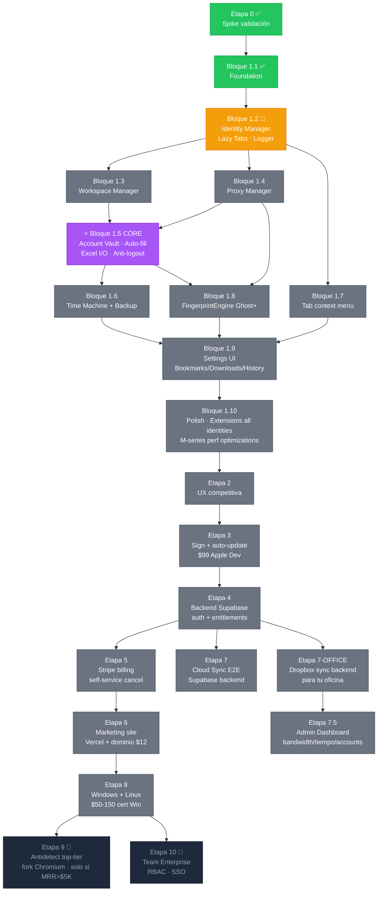

# OZ Browser — Diagrama de dependencias entre bloques



---

## Path crítico (cómo llegar a "vendible")

```
1.2 cierre  →  1.3  →  1.4  →  1.5 ⭐  →  1.6  →  1.7
                                  ↓
                      1.8 (puede ir en paralelo)
                                  ↓
                  1.9  →  1.10  →  Etapa 2  →  Etapa 3
                                                ↓
                                    Etapa 4  →  5  →  6  =  PRODUCTO VENDIBLE
```

---

## Reglas transversales (aplican a TODOS los bloques)

Estas decisiones afectan cada módulo del proyecto y NO tienen que repetirse en cada bloque:

### Performance (Apple Silicon)
- Universal binary arm64 nativo. Sin Rosetta. Sin C++ addons que no soporten arm64.
- Tab discarding daemon respeta los límites del Performance mode.
- Memory pressure handler activo en todos los modos.
- Cache caps por partition (50 MB Light, 100 MB Balanced, 200 MB Power).
- Disk I/O: SQLite WAL mode, lazy partition init, compresión zstd para snapshots.

### Logging
- Cada operación crítica loggea via `logger.js` (DEBUG/INFO/WARN/ERROR).
- Errores no manejados → `error-handler.js` popup con email a Jose.
- Activity tracker registra eventos comerciales (bandwidth, time, accounts).

### Persistencia
- Datos sensibles (vault) → AES-256-GCM, master key en macOS Keychain.
- Datos no sensibles (identities, workspaces, proxies) → JSON plano en `data/`.
- Snapshots automáticos antes de operaciones destructivas.

### Sync (cuando exista)
- Backend pluggable: Cloud OZ (Supabase) / Dropbox / S3 self-hosted / Off.
- Cliente cifra antes de subir. Backend solo ve blobs.
- Conflict resolution last-write-wins → vector clocks v2.

### UX
- Todo IPC pasa por `window.oz.*` (preload bridge). Renderer NUNCA llama a Node directo.
- Renderer errors se reportan via `oz.log.reportError(...)` al main.
- Todo en español para Jose / oficina; inglés para SaaS público (i18n en Etapa 6).

### Seguridad
- Master password nunca toca disco en plaintext.
- Tokens (Stripe, Supabase, Dropbox) en env vars o macOS Keychain.
- Logs nunca contienen passwords/tokens (filter automático).
- Updates firmados (Etapa 3 onwards).

### Modularidad
- Cada bloque entrega un módulo `browser/X-manager.js` autocontenido.
- IPC channels namespaceados: `oz:identities:*`, `oz:proxies:*`, `oz:vault:*`, etc.
- Tests por módulo (cuando lleguemos a Etapa 1B).
